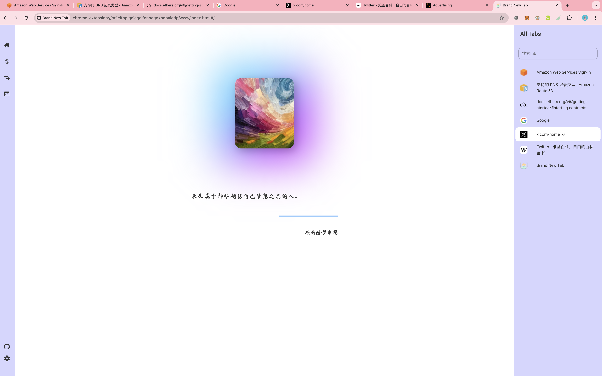

# Brand New Tab - README

## 简介

欢迎使用 **Brand New Tab** ——一款功能强大的谷歌 Chrome 插件，旨在通过提供多种实用工具和可定制的界面来提升您的浏览体验。这个开源插件非常适合开发人员、高级用户以及任何希望提高上网效率的人。

## 愿景

我衷心的希望各位开发者、打工人每天进步一点点，总有一天会成功！

## 功能

### 1. 主题切换

Brand New Tab 提供多种主题以满足您的偏好和环境需求：

- **默认**
- **暗黑**
- **简洁**
- **优雅**
- **古典**

### 2. 以太坊开发工具

为以太坊开发人员提供必备工具，例如：

- **ABI 编码/解码**：编码和解码 ABI（应用二进制接口）数据。
- **消息签名**：使用您的以太坊私钥签名消息。
- **密钥转换**：在私钥、公钥和地址之间进行转换。
- **KDF 加密/解密**：使用密钥派生函数进行安全加密和解密。

### 3. 转换工具

轻松在各种数据格式之间转换并进行哈希计算：

- **数据转换**：支持在 Hex、UTF-8、UTF-16、Decimal 和 Binary 之间进行转换。
- **哈希计算**：使用 MD5、SHA1、SHA3、SHA256、SHA512、Keccak224、Keccak256、Keccak384 和 Keccak512 等算法计算哈希值。
- **编码/解码**：提供 URL 编码/解码和 Base64 编码/解码工具。

### 4. 前端开发工具

为网页开发人员提供有用的工具以提高工作效率：

- **JSON 比较**：比较和查找 JSON 对象之间的差异。
- **图片转 Base64**：将图片转换为 Base64 字符串。
- **在线绘图**：直接在浏览器中创建绘图的简单工具。

### 5. 增强的标签页管理

当您打开许多浏览器标签页时，导航会变得困难。Brand New Tab 帮助您高效管理标签页：

- **标签页搜索**：在新标签页中轻松搜索并切换到所需的标签页。
- **标签页列表**：在新标签页页面的右侧查看所有打开的标签页，并通过单击轻松切换。

## 安装

要安装 Brand New Tab，请按照以下步骤操作：

1. 从[Chrome 网上应用店](#)下载插件。
2. 点击 `添加到 Chrome` 按钮。
3. 安装完成后，打开一个新标签页开始使用插件。

## 使用方法

1. **切换主题**：从新标签页右上角的主题切换器中选择您喜欢的主题。
2. **使用开发工具**：从新标签页的工具面板中访问以太坊开发工具、数据转换工具和前端工具。
3. **管理标签页**：使用标签页搜索功能快速找到并切换到所需的标签页。右侧的标签页列表允许您在所有打开的标签页之间轻松导航。

## 贡献

欢迎对 Brand New Tab 的改进做出贡献！以下是您可以参与的方式：

1. 在 GitHub 上 fork 这个仓库。
2. 创建一个新的分支（`git checkout -b feature-branch`）。
3. 提交您的更改（`git commit -m 'Add new feature'`）。
4. 推送到分支（`git push origin feature-branch`）。
5. 打开一个 Pull Request。

## 许可证

本项目采用 MIT 许可证。详细信息请参阅 [LICENSE](LICENSE) 文件。

## 联系方式

如果您有任何问题、建议或反馈，请在 GitHub 上提交 issue 或通过 [your-email@example.com](mailto:your-email@example.com) 联系维护者。

---

衷心希望您喜欢使用 Brand New Tab，并在日常浏览和开发活动中发现它的帮助！

---

# Brand New Tab - README

## Introduction

Welcome to **Brand New Tab** - a versatile Google Chrome extension designed to enhance your browsing experience with a variety of useful tools and a customizable interface. This open-source extension is perfect for developers, power users, and anyone looking to improve their productivity while surfing the web.

## Vision

I sincerely hope that every developer and hard-working individual makes a little progress every day, and one day, success will be yours!

## Features

### 1. Theme Switching

Brand New Tab offers multiple themes to suit your preferences and environment:

- **Default**
- **Dark**
- **Simple**
- **Elegant**
- **Classic**

### 2. Ethereum Development Tools

For developers working with Ethereum, Brand New Tab includes essential tools such as:

- **ABI Encode/Decode**: Encode and decode ABI (Application Binary Interface) data.
- **Sign Message**: Sign messages with your Ethereum private key.
- **Key Conversion**: Convert between private keys, public keys, and addresses.
- **KDF Encryption/Decryption**: Utilize Key Derivation Functions for secure encryption and decryption.

### 3. Conversion Tools

Easily convert between various data formats and perform hash calculations:

- **Data Conversion**: Supports conversions between Hex, UTF-8, UTF-16, Decimal, and Binary.
- **Hash Calculations**: Compute hashes using algorithms like MD5, SHA1, SHA3, SHA256, SHA512, Keccak224, Keccak256, Keccak384, and Keccak512.
- **Encoding/Decoding**: Tools for URL encoding/decoding and Base64 encoding/decoding.

### 4. Front-End Development Tools

Useful tools for web developers to enhance their workflow:

- **JSON Diff**: Compare and find differences between JSON objects.
- **Image to Base64**: Convert images to Base64 strings.
- **Online Drawing**: A simple tool to create drawings directly in the browser.

### 5. Enhanced Tab Management

When you have many browser tabs open, it can be difficult to navigate between them. Brand New Tab helps you manage your tabs efficiently:

- **Tab Search**: Easily search for and switch to the desired tab from a new tab page.
- **Tab List**: View a list of all open tabs on the right side of the new tab page and switch between them with a single click.

## Installation

To install Brand New Tab, follow these steps:

1. Download the extension from the [Chrome Web Store](#).
2. Click on the `Add to Chrome` button.
3. Once installed, open a new tab to start using the extension.

## Usage

1. **Switch Themes**: Select your preferred theme from the theme switcher in the top-right corner of the new tab page.
2. **Use Development Tools**: Access the Ethereum development tools, data conversion tools, and front-end tools from the tools panel on the new tab page.
3. **Manage Tabs**: Use the tab search feature to quickly find and switch to the tab you need. The tab list on the right side allows for easy navigation between all open tabs.

## Contributing

Welcome contributions to improve Brand New Tab! Here’s how you can get involved:

1. Fork the repository on GitHub.
2. Create a new branch (`git checkout -b feature-branch`).
3. Commit your changes (`git commit -m 'Add new feature'`).
4. Push to the branch (`git push origin feature-branch`).
5. Open a Pull Request.

## License

This project is licensed under the MIT License. See the [LICENSE](LICENSE) file for details.

## Contact

For questions, suggestions, or feedback, please open an issue on GitHub or contact the maintainer at [your-email@example.com](mailto:your-email@example.com).

---

I hope you enjoy using Brand New Tab and find it helpful in your daily browsing and development activities!
